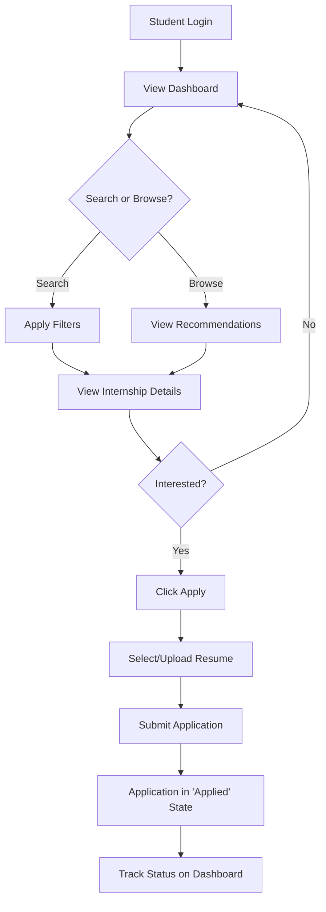
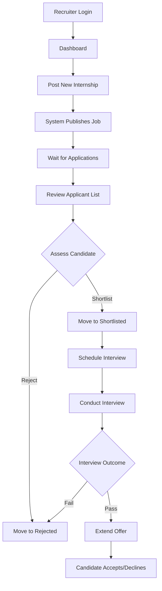
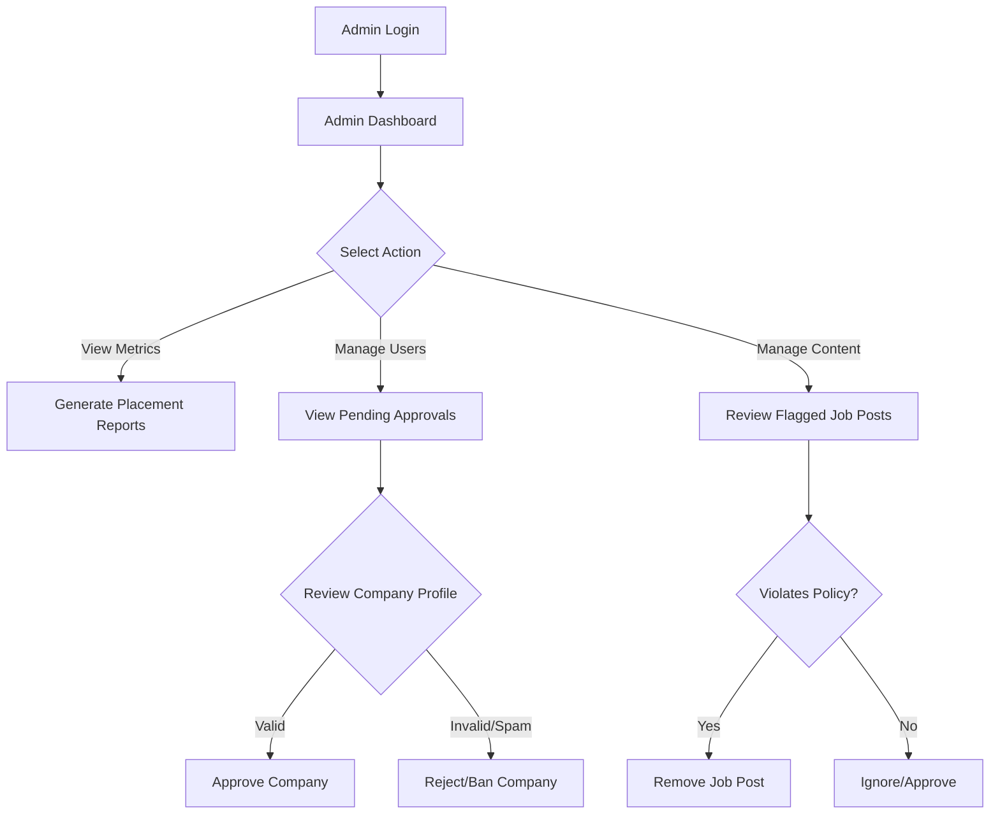

# System Workflows

This document details the core processes of the platform using Mermaid diagrams.

## 1. Student Internship Application Flow

This workflow illustrates how a student discovers and applies for an internship, and tracks their application.

## 2. Recruiter Hiring Flow

This workflow shows how a recruiter posts a job, reviews applications, and extends an offer.

## 3. Admin Monitoring Flow

This workflow demonstrates how an administrator oversees platform activities and verifies users.

